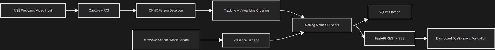
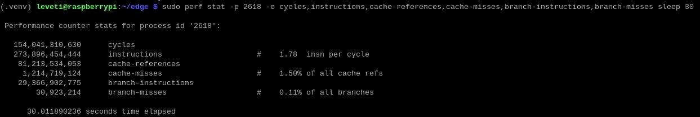

# Privacy-Preserving Entrance Flow and Busyness Monitoring Using Edge Analytics (Raspberry Pi 5)

This project presents a privacy-preserving edge analytics system for monitoring entrance flow and busyness using a Raspberry Pi 5. The system performs on-device sensing, detection, tracking, and event aggregation so that operational metrics can be produced without relying on cloud inference.

The implementation combines camera-based person detection and line-crossing analysis with mmWave-assisted presence sensing to estimate entry and exit activity, recent crossing counts, and busyness level. Results are exposed through a local dashboard, REST API, SSE stream, and validation workflow for deployment, calibration, and performance evaluation. The validated hardware configuration uses a `Logi C270 HD` webcam over USB/UVC and an `MR24HPC1` mmWave sensor connected through GPIO UART.

## Core features

- Vision pipeline:
  - webcam or recorded video input
  - ONNX Runtime person detection (YOLOv11n)
  - centroid tracking and virtual line crossing
- mmWave integration:
  - serial mode for MR24HPC1 sensor input via GPIO UART
  - vote-based smoothing for noisy presence readings
  - mock mode for hardware-independent testing
- Edge service and dashboard:
  - rolling metrics and recent events
  - live dashboard and SSE stream
  - local calibration, configuration, and validation pages
- Local persistence:
  - SQLite storage for snapshots, events, and validation sessions

## Repository layout

```text
/edge
├── README.md                    # Project overview, evidence summary, and deployment guide
├── pyproject.toml               # Python package metadata and dependencies
├── yolo11n.onnx                 # Deployed ONNX detector model
├── /assets                      # Architecture diagram used in the README
├── /config                      # Raspberry Pi, Windows, and mock/test configurations
├── /evidence                    # PASO, benchmark, and profiling artifacts used in submission
├── /scripts                     # Export, benchmark, comparison, and quantization utilities
├── /src/entrance_monitor
│   ├── main.py                  # Application entry point
│   ├── api.py                   # Dashboard, REST, and SSE routes
│   ├── service.py               # Runtime orchestration and status generation
│   ├── detector.py              # ONNX preprocessing, inference, and decode logic
│   ├── camera.py                # Camera capture, ROI handling, and reconnect logic
│   ├── mmwave.py                # MR24HPC1 serial/mock handling
│   ├── tracking.py              # Centroid tracking and line-crossing logic
│   ├── storage.py               # SQLite persistence
│   └── /web                     # Static assets and HTML templates
└── /tests                       # PASO runner and automated tests
```

## System architecture



- camera input is processed locally for detection, tracking, and line-crossing estimation
- mmWave input corroborates presence events and supports sensor-assisted runtime control
- metrics and events are stored locally in SQLite and published through REST, SSE, and the web dashboard
- calibration and validation workflows are provided through local routes for configuration and testing

## Hardware

- Edge platform: Raspberry Pi 5
- Vision sensor: USB webcam (UVC-compatible, e.g. Logitech C270)
- mmWave sensor: Seeed Studio MR24HPC1, wired to GPIO UART (TX=pin8, RX=pin10) at 115200 baud
- Inference runtime: ONNX Runtime (CPU)
- Backend: FastAPI + Uvicorn
- Storage: SQLite

## Justification of Hardware and Tools Selection

- `Raspberry Pi 5`
  - selected as the deployment platform because it provides a practical balance of CPU capability, GPIO/UART connectivity, and affordability for an edge analytics project
  - suitable for the project objective because inference, tracking, sensing, storage, and the local dashboard can all run on-device without cloud dependency
- `Logi C270 HD webcam`
  - selected because it is inexpensive, widely available, UVC-compatible, and easy to integrate with OpenCV on both Windows and Raspberry Pi
  - suitable for the project objective because `1280x720` video is sufficient for doorway monitoring, line-crossing analysis, and validation runs
- `MR24HPC1 mmWave sensor`
  - selected to complement the camera with a lightweight presence signal that is less affected by visible-light conditions
  - suitable for the project objective because it provides auxiliary sensing for corroboration, fault handling, and sensor-assisted runtime control
- `ONNX Runtime`
  - selected because it provides a practical CPU inference runtime for deploying an ONNX detector on Raspberry Pi 5
  - suitable for the project objective because it allows the YOLO detector to run on-device without introducing a heavier runtime stack
- `FastAPI + Uvicorn`
  - selected because it provides a lightweight web/API layer for status reporting, validation control, and local dashboard delivery
  - suitable for the project objective because the project requires REST endpoints, SSE streaming, and browser-based calibration pages on the device itself
- `SQLite`
  - selected because it is embedded, file-based, and requires no external database service
  - suitable for the project objective because snapshots, crossing events, and validation sessions can be stored locally with minimal operational overhead

## Project Stages and GitHub Progress Updates

### Project stages

- Stage 1 established the problem scope and architecture for privacy-preserving entrance monitoring on Raspberry Pi 5.
- Stage 2 implemented the vision pipeline for capture, ONNX detection, tracking, and line crossing.
- Stage 3 integrated mmWave sensing and service-layer orchestration for dual-sensor operation.
- Stage 4 added the dashboard, REST API, SSE stream, and validation workflow for on-device monitoring and evaluation.
- Stage 5 added PASO instrumentation, benchmarking, and profiling to measure latency, throughput, and resource usage.
- Stage 6 validated the final Raspberry Pi deployment and consolidated the measured evidence in this repository.

### Regular updates maintained on GitHub

Regular progress updates were maintained through tracked changes to the runtime modules in `src/entrance_monitor/`, deployment configurations in `config/`, automated tests in `tests/`, measured evidence in `evidence/`, and submission documentation in `README.md`.

---

## User Experience Considerations

- the project exposes a browser-based dashboard so monitoring can be performed without direct access to the application process
- the dashboard is separated from calibration-oriented routes such as `/settings`, `/validation`, and `/debug`, which reduces clutter during normal monitoring
- SSE is used so that the dashboard can receive live updates without requiring repeated manual refreshes
- Windows access instructions are included so the dashboard can be viewed from another machine on the same network during demonstrations and deployment

## Scalability, Future-Proofing, and Interoperability

- the implementation is modular, with sensing, inference, tracking, storage, API delivery, and validation separated into distinct modules under `src/entrance_monitor/`
- deployment-specific behaviour is separated through configuration files in `config/`, which makes it easier to extend the system to other devices or test modes without rewriting the runtime
- ONNX Runtime was selected because it provides a practical and lightweight CPU inference backend for Raspberry Pi deployment
- the project already uses interoperable and widely supported interfaces and standards, including UVC for the webcam, UART serial for the mmWave sensor, REST and SSE for local communication, and SQLite for embedded storage
- future enhancements can be introduced incrementally, such as improved models, additional sensors, stronger access control, or more advanced analytics, without requiring a full redesign of the current architecture

## Security and Privacy Measures

- default route exposure:
  - the tracked Pi deployment configs in this repo (`config/pi.yaml` and `config/pi.sample.yaml`) set `app.local_debug_only: false`
  - in that Pi configuration, any host that can reach port `8000` can access the main dashboard, status and metrics APIs, SSE stream, and the calibration/debug routes
  - the development-oriented configs (`config/default.yaml`, `config/windows-webcam.yaml`, and `config/windows-video.sample.yaml`) set `app.local_debug_only: true`
  - when `app.local_debug_only: true`, the application restricts `/debug`, `/settings`, `/validation`, `/api/v1/settings`, `/api/v1/validation/*`, and `/api/v1/debug/frame.jpg` to localhost
- privacy boundary:
  - all inference is performed locally on the Raspberry Pi, which reduces dependence on external cloud processing
  - raw video is not persisted by the default storage pipeline; stored outputs are derived metrics, crossing events, and validation records
  - the `/api/v1/debug/frame.jpg` route can expose the current annotated camera frame when debug routes are reachable, so that route should be treated as sensitive operational access
  - the architecture is privacy-preserving for the intended use case because the normal outputs are flow and busyness metrics rather than identity-based recognition results
- deployment guidance:
  - use `app.local_debug_only: true` for a stricter single-device boundary
  - if remote monitoring or calibration is required, keep the service on a trusted network and add host-level firewalling or an authenticated reverse proxy

## Testing and Validation Strategy

- automated tests in `tests/` cover API behaviour, detector logic, tracking, storage, service logic, and benchmark sampling
- PASO diagnostics were used to evaluate latency, resource usage, scheduling behaviour, and basic fault handling on the Raspberry Pi deployment target
- benchmark artifacts in `evidence/` were used to quantify sustained throughput, latency, CPU usage, RAM usage, and temperature
- validation sessions were used to compare system counts against manual ground truth, and disconnection tests were used to verify camera and mmWave fault detection and recovery behaviour

---

## Measured Raspberry Pi 5 Results

The evidence set in `evidence/` shows that the Raspberry Pi 5 deployment is stable enough for live entrance monitoring in the tested Pi configuration, with a configured `10 FPS` camera cadence and CPU-only ONNX inference.

Main artifacts:
- `evidence/PASO_DIAGNOSTIC_20260329T051145Z.md`
- `evidence/summary.md`

Submission measurements:
- PASO run: `10.56 FPS` capture, `8.0 FPS` detector throughput, `74.75 ms` detector total latency, `75.49 ms` per-frame total latency, `9/9` healthy samples, and no observable publish backlog
- PASO resource window: `51.7%` CPU, `1204.375 MB` RAM, `82.6 C` API temperature, and `83.4 C` OS temperature
- Validation and fault handling from the same PASO evidence set: entry, exit, and total counts matched ground truth in the recorded validation session, while both camera and mmWave unplug/replug tests passed
- 30-second benchmark: `10.4 FPS` delivered throughput, `8.2 FPS` detector throughput, `0.04` average drop ratio, `64.03 ms` detector total latency, `64.77 ms` per-frame total latency, `54.81%` CPU, `1347.49 MB` RAM, and `82.86 C` average temperature

Profiling summary:
- `perf stat` recorded `1.78` instructions per cycle with low cache-miss (`1.50%`) and branch-miss (`0.11%`) rates, indicating efficient CPU execution
- `perf report` showed that most sampled CPU time was spent inside `onnxruntime_pybind11_state`, so ONNX inference is the dominant runtime hotspot
- `cProfile` was dominated by startup/import-time Python work (FastAPI, Pydantic, and module loading), so it did not indicate a strong case for line-level Python profiling

### Evidence screenshots

**perf stat**



**perf report**

.png)

**cProfile**

.png)

### Submission conclusions

- stable live monitoring was demonstrated at approximately `10 FPS` camera throughput and `8 FPS` detector throughput on Raspberry Pi 5
- the dominant runtime hotspot is ONNX inference rather than the tracker or HTTP layer
- measured CPU, RAM, and temperature remained within a practical Pi 5 operating range during the submission runs, with historical throttle flags noted in PASO
- camera and mmWave disconnect recovery both worked in the tested setup
- the system is suitable as a practical Pi 5 deployment for the project

---

## Raspberry Pi 5 Deployment

### 1. Prepare the Pi and enable UART

```bash
sudo apt update
sudo apt install -y python3 python3-venv python3-pip git libcap-dev v4l-utils sqlite3
sudo raspi-config
# Interface Options -> Serial Port
# -> No to login shell over serial
# -> Yes to serial port hardware enabled
sudo reboot
```

The MR24HPC1 connects to the Pi 5 GPIO UART pins (TX=pin8, RX=pin10).

### 2. Clone and install

```bash
git clone https://github.com/Levetiii/Edge-Computing.git edge
cd edge
python3 -m venv .venv
source .venv/bin/activate
pip install --upgrade pip
pip install -e ".[dev,serial]"
```

### 3. Create local config

```bash
cp config/pi.yaml config/pi.local.yaml
```

`config/pi.yaml` is pre-configured for the Pi 5 with:
- camera on `/dev/video0` via `v4l2` at `1280x720` and `10 FPS`
- mmWave on `/dev/ttyAMA0` at `115200` baud in serial mode
- YOLO11n ONNX model

Edit `config/pi.local.yaml` only if your hardware differs.

### 4. Run

```bash
source .venv/bin/activate
entrance-monitor --config config/pi.local.yaml
```

Find the Pi IP with `hostname -I`, then open `http://<pi-ip>:8000` from any device on the same network. The tracked Pi configs in this repo set `app.local_debug_only: false`, so remote clients on the same network can also reach `/debug`, `/settings`, `/validation`, and the related debug/validation API endpoints. For a stricter deployment boundary, set `app.local_debug_only: true` or place the service behind network-level access control.

## System outputs

| Metric | Description |
|---|---|
| `entry_count_30s` | Entries in the last 30 seconds |
| `exit_count_30s` | Exits in the last 30 seconds |
| `net_count_30s` | Net flow in the last 30 seconds |
| `crossing_count_30s` | Total crossings in the last 30 seconds |
| `entry_rate_per_min` | Projected entry rate per minute |
| `exit_rate_per_min` | Projected exit rate per minute |
| `net_flow_per_min` | Projected net flow per minute |
| `busyness_level` | Low / Medium / High based on crossing intensity |

## Scope and limitations

- single-entrance monitoring only
- counting accuracy may degrade under heavy occlusion or simultaneous side-by-side crossings
- mmWave presence detection sensitivity depends on room size and sensor placement and works best when the sensor is co-located with the camera, pointed directly at the entrance zone
- `/debug`, `/settings`, and `/validation` are calibration-oriented routes and should only be exposed on trusted networks; local-only enforcement depends on `app.local_debug_only`
